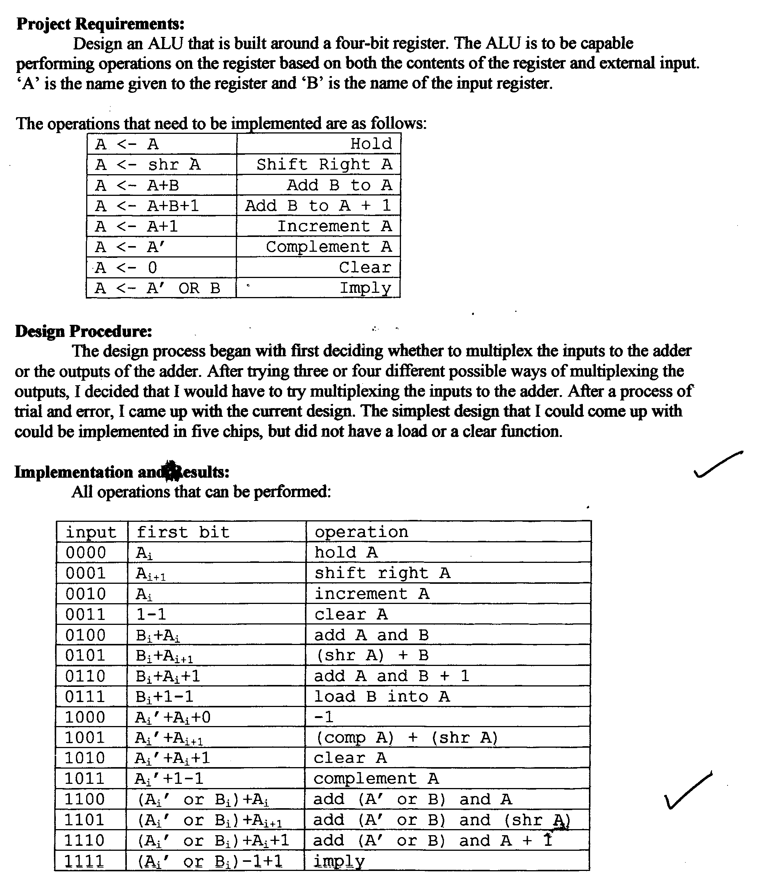
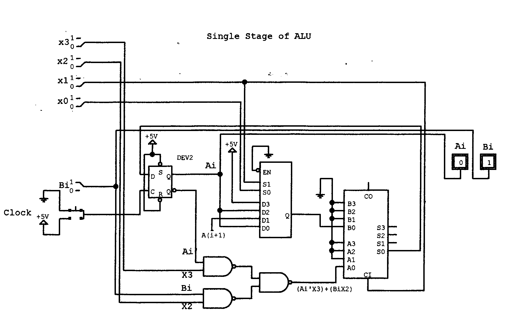
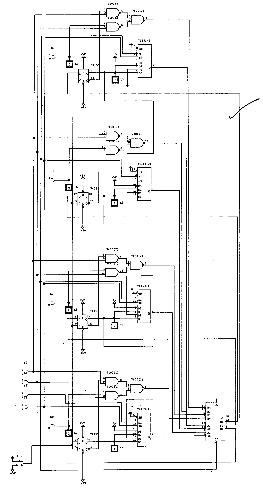
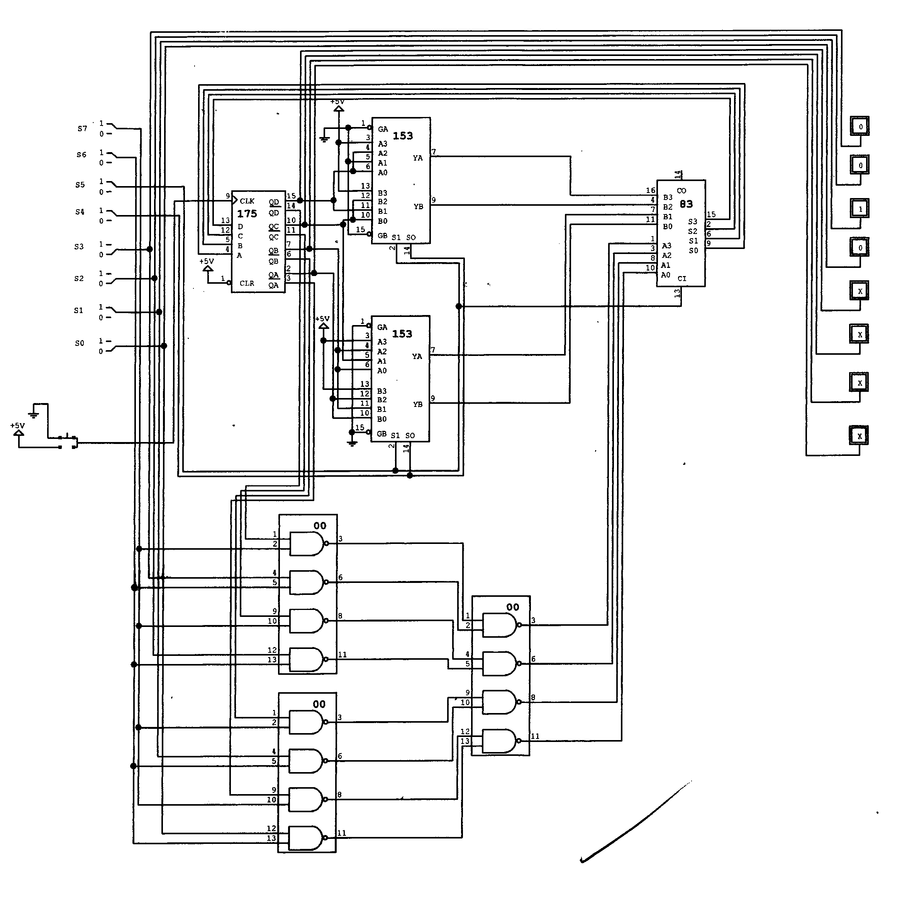
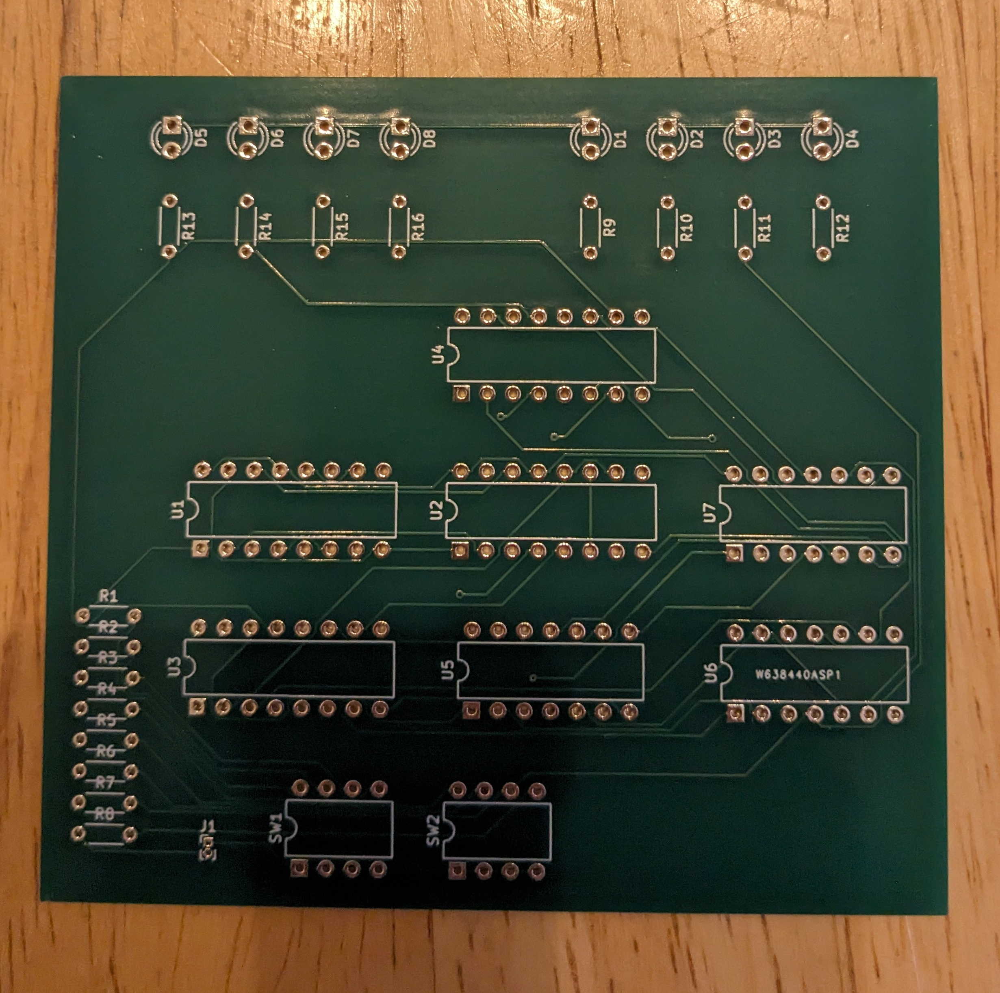
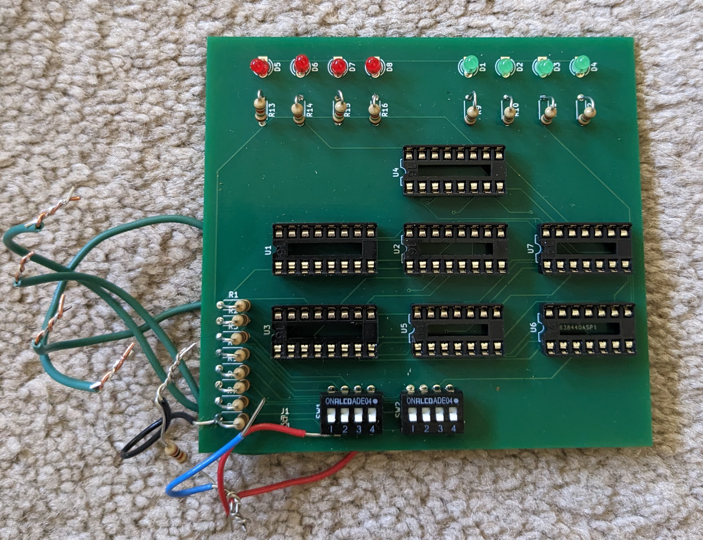
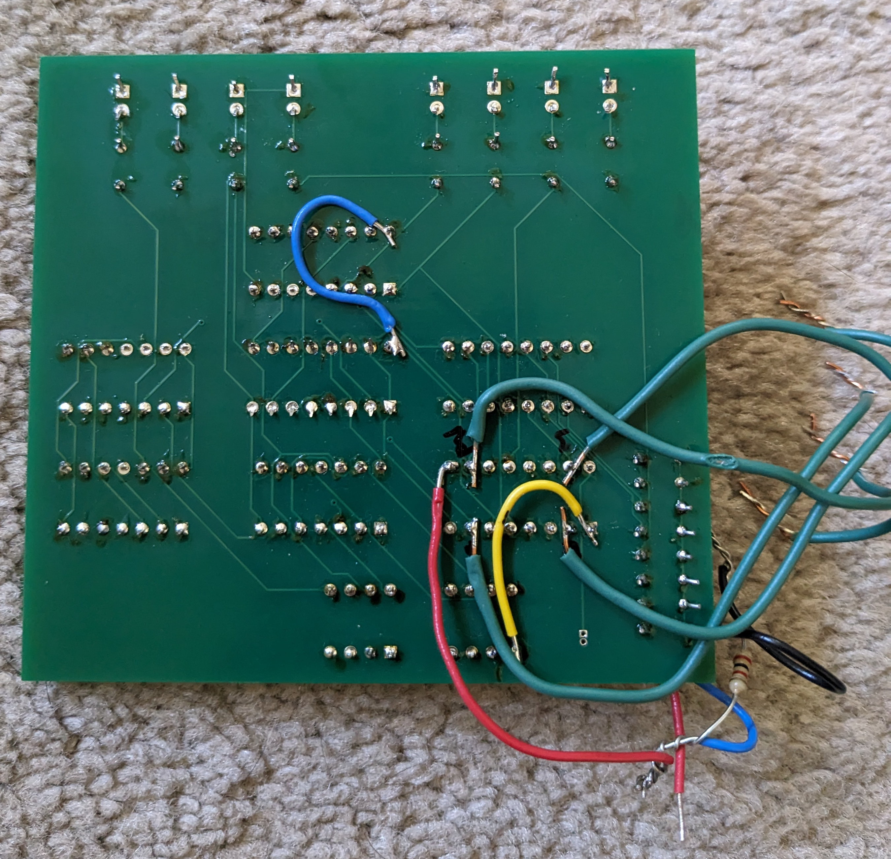
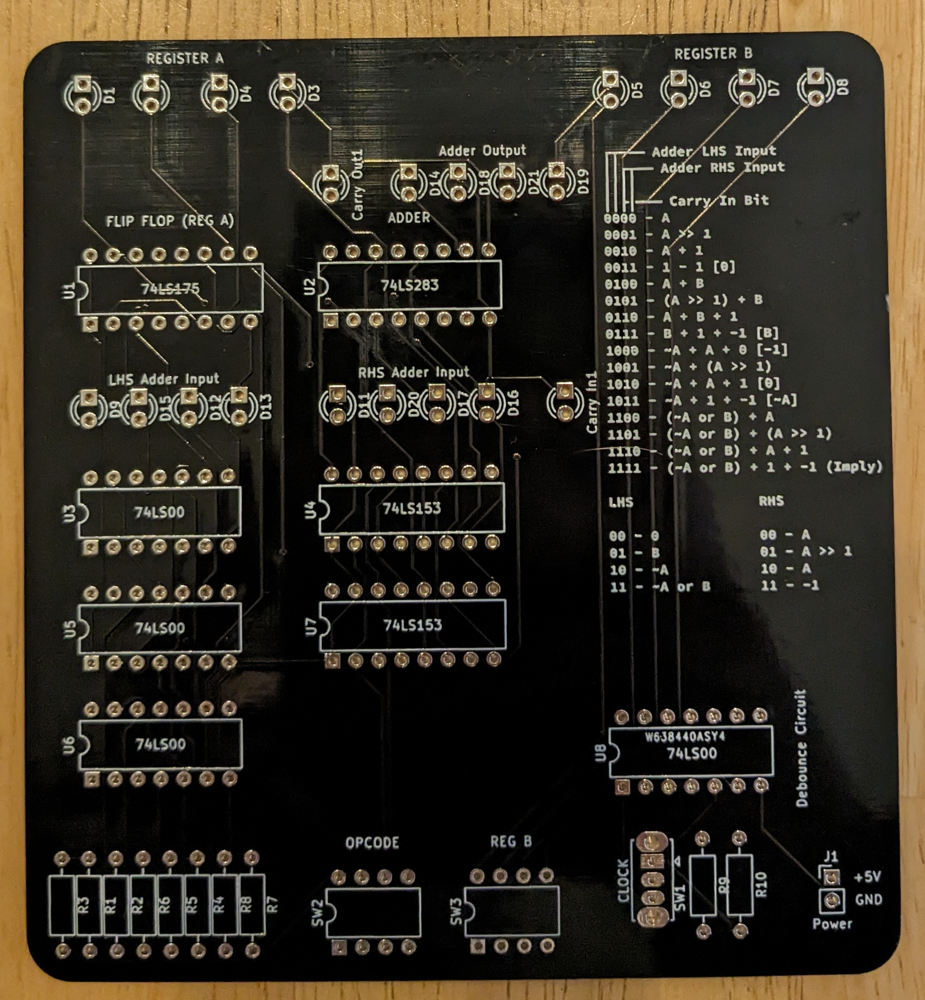
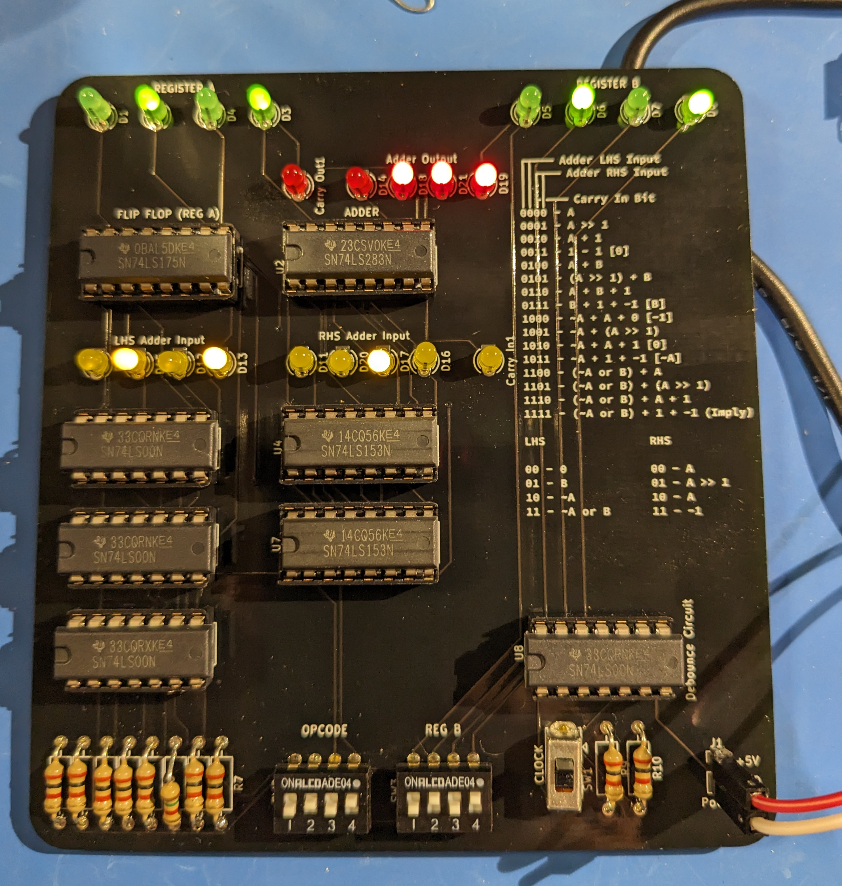

# 4bitalu

## Background

This project is derived from my ECPE 2504 class that I took at Virginia Tech. The project was submitted on March 18, 1998.

The goal of the class project was to create a "Nibble Slice ALU".

This was a project that had:

 * A 4 bit register (SR Latch Flip-Flop)
 * 4 bit opcode input
 * 4 bit operand input

We were allowed to use 7400 series TTL logic chips

 * 74153 4-bit multiplexers (x2)
 * 74175 Flip-Flop
 * 7483 4-bit adder
 * 7400 Quad NAND (x3)

The projects were built on breadboards with jumpers, switches, chips provided by the university (no pictures of the original were taken)

Requirements:

* 'A' input is the 4bit flip-flop
* 'B' input is a 4bit dip switch
* OpCode is a 4bit dip switch
* 8 instructions were required
  1. A <- A (Hold)
  2. A <- shr A (Shift-Right A)
  3. A <- A+B (Add B to A)
  4. A <- A+B+1 (Add B to A + 1)
  5. A <- A+1 (Increment A)
  6. A <- A' (Complement A)
  7. A <- 0 (Clear A)
  8. A <- A' OR B (Imply)

8 instructions were required - but we have 16 possible opcodes. That means we ended up with an additional 8 "unintended" or "undocumented" OpCodes!

The original product requirements doc follows:
 

  
## Original Design

## 2023 Build

I decided 25 years later to try my hand at PCB design and to actually build this old project. This took 2 revisions:

1. [Rev 1](df868067a174cf4c2a293e076a1fb69d7d88c638) had several issues
  * Power pins were not connected
  * Clock signal was not connected
  * All of the bits input to the adder were reversed because the new tool I was using (KiCad) had the pins in a different order compared to the schematics from 1998
  * The register LEDs were actually connected to the output of the adder, not to the output of the Flip-Flop (so I was reading what would be, not what currently was!)
2. [Rev 2](fc047236eafd9e9970c500b91abf409b33e64aa5) fixed those problems, and did not introduce any new ones, it does work!
  * Except that the pull-down resistors for the inputs are spec'd too high, so the carry-in bit to the adder was always around 1 volt.
  * This should not have been a problem, those adders should not register high unless the value is at least 2v, but it was always Carrying-In an extra bit (effectively every result was the expected result + 1)
  * Also many (optional) LEDs are added for observing the processes in play
3. Rev 3 is currently in process
  * Adds power filtering capacitors to the VCC of the 74's chips
  * Inverts the output of the clock switch (in rev2 down is high and up is low)
  * Adds an LED to show the current state of the clock input

These project files are all in KiCad format, if anyone wishes to fork / build their own / test this stuff out too

## Images

## Rev 1

Rev 1 Empty

Rev 1 Front

Rev 1 Back with bodge wires

## Rev 2

Rev 2 Empty

Rev 2 Running!

